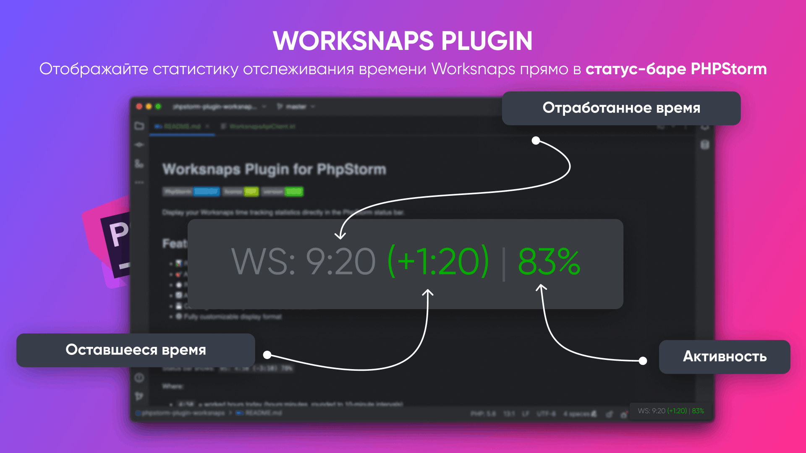

# Worksnaps Plugin for PhpStorm

[Русский](README.md) | [English](README_EN.md)

---




Отображайте статистику отслеживания времени Worksnaps прямо в строке состояния PhpStorm.

## Возможности

- 📊 Отображение отработанных часов за сегодня в реальном времени
- 🎯 Процент активности с цветовым кодированием (зеленый ≥80%, желтый 60-79%, красный <60%)
- ⏱️ Оставшееся время до целевого количества часов (настраивается, по умолчанию: 8 часов)
- 🔄 Автоматическое обновление каждые 60 секунд (настраивается)
- 💾 Кэширование для надежности при недоступности API
- ⚙️ Полностью настраиваемый формат отображения

## Скриншоты

Строка состояния показывает: `WS: 9:30 (+1:30) | 87%`

Где:
- `9:30` = отработано часов сегодня (часы:минуты, округлено до 10-минутных интервалов)
- `(+1:30)` = переработка 1 час 30 минут (зеленый если переработка, красный если осталось работать)
- `87%` = процент активности (зеленый для ≥80%, желтый для 60-79%, красный для <60%)

## Требования

- PhpStorm 2022.3 или новее
- Активный аккаунт Worksnaps с доступом к API
- Java 17 или новее (только для разработки плагина)

## Установка

### Из JetBrains Marketplace (Скоро)

1. Откройте PhpStorm
2. Перейдите в **Settings/Preferences → Plugins**
3. Найдите "Worksnaps"
4. Нажмите **Install**
5. Перезапустите PhpStorm

### Ручная установка

1. Скачайте последний релиз из [Releases](https://github.com/curkan/phpstorm-plugin-worksnaps/releases)
2. В PhpStorm перейдите в **Settings/Preferences → Plugins**
3. Нажмите на иконку шестеренки ⚙️ и выберите **Install Plugin from Disk...**
4. Выберите скачанный `.zip` файл
5. Перезапустите PhpStorm

### Сборка из исходников

```bash
# Клонируйте репозиторий
git clone https://github.com/curkan/phpstorm-plugin-worksnaps.git
cd phpstorm-plugin-worksnaps

# Соберите плагин
./gradlew buildPlugin

# Плагин будет в build/distributions/
```

## Настройка

### 1. Получите ваш API токен

1. Войдите в ваш аккаунт Worksnaps
2. Перейдите в **Profile & Settings → Web Service API**
3. Нажмите "Show my API Token"
4. Скопируйте токен

### 2. Получите ID проекта

Вы можете найти ID проекта двумя способами:

**Вариант A: Из URL**
- Откройте ваш проект в веб-интерфейсе Worksnaps
- ID проекта находится в URL: `https://app.worksnaps.com/projects/YOUR_PROJECT_ID`

**Вариант B: Через API**
```bash
curl -u "YOUR_API_TOKEN:" https://api.worksnaps.com/api/projects.xml
```

### 3. Настройте плагин

1. Откройте PhpStorm
2. Перейдите в **Settings/Preferences → Tools → Worksnaps**
3. Введите вашу конфигурацию:
   - **API Token** (обязательно): Ваш Worksnaps API токен
   - **Project ID** (обязательно): ID вашего Worksnaps проекта
   - **User ID** (опционально): Оставьте пустым для автоопределения
   - **Update Interval**: Как часто обновлять данные (по умолчанию: 60 секунд)
   - **Target Hours**: Ваша дневная цель работы (по умолчанию: 8 часов)
   - **Display Options**: Выберите что показывать в строке состояния

4. Нажмите **Apply** и **OK**

## Использование

После настройки плагин автоматически отобразит вашу статистику Worksnaps в строке состояния PhpStorm.

### Отображение в строке состояния

Виджет показывает:
- Префикс (настраивается, по умолчанию: "WS:")
- Отработанное время (если включено)
- Оставшееся время в скобках (если включено)
- Процент активности (если включено)
- Индикатор предупреждения (⚠) если используются кэшированные данные из-за ошибки API

### Действия по клику

Нажмите на виджет в строке состояния для ручного обновления данных.

### Состояния отображения

- `WS: N/A` - API токен или Project ID не настроены
- `WS: Loading...` - Загрузка данных из API
- `WS: 4:50 (-3:10) | 78%` - Обычное отображение
- `WS: 8:30 (+0:30) | 85%` - Переработка (30 минут сверх цели)
- `WS: 4:50 (-3:10) | 78% ⚠` - Используются кэшированные данные из-за ошибки API
- `WS: ⚠ Error` - Ошибка API и нет кэшированных данных

## Справочник настроек

| Настройка | По умолчанию | Описание |
|-----------|--------------|----------|
| API Token | (пусто) | Ваш Worksnaps API токен (обязательно) |
| Project ID | (пусто) | ID вашего Worksnaps проекта (обязательно) |
| User ID | (пусто) | Ваш ID пользователя (опционально, автоопределяется если пусто) |
| Update Interval | 60 | Интервал обновления в секундах |
| Target Hours | 8.0 | Дневная цель работы в часах |
| Prefix | "WS:" | Текст перед статистикой |
| Show Time | ✓ | Показывать отработанные часы |
| Show Activity | ✓ | Показывать процент активности |
| Show Remaining | ✓ | Показывать оставшееся время до цели |

## Решение проблем

### Виджет показывает "WS: N/A"

**Решение**: Настройте ваш API токен и project ID в **Settings → Tools → Worksnaps**

### Виджет показывает "WS: ⚠ Error"

Возможные причины:
- Неверный API токен
- Неверный project ID
- Нет подключения к интернету
- Worksnaps API недоступен

**Решение**:
1. Проверьте правильность вашего API токена
2. Проверьте правильность вашего project ID
3. Проверьте интернет-соединение
4. Проверьте API вручную:
   ```bash
   curl -u "YOUR_TOKEN:" https://api.worksnaps.com/api/projects.xml
   ```

### Данные не обновляются

**Решение**:
1. Кликните на виджет для ручного обновления
2. Проверьте интервал обновления в настройках
3. Перезапустите PhpStorm

### Неправильный процент активности

**Примечание**: Worksnaps рассчитывает активность на основе использования клавиатуры и мыши. Плагин показывает среднюю активность по всем 10-минутным записям времени за сегодня.

## Как это работает

1. Плагин загружает записи времени из Worksnaps API за текущий день
2. Рассчитывает общее количество отработанных часов и средний процент активности
3. Результаты кэшируются на 60 секунд
4. Если API недоступен, используются кэшированные данные с индикатором предупреждения
5. Строка состояния обновляется автоматически на основе настроенного интервала

## Использование API

- **Endpoint**: `https://api.worksnaps.com/api/projects/{project_id}/time_entries.xml`
- **Аутентификация**: HTTP Basic Auth (API токен как имя пользователя, пустой пароль)
- **Ограничение частоты**: Плагин использует кэширование для минимизации запросов к API
- **Формат данных**: XML (парсится с помощью regex)

## Конфиденциальность и безопасность

- Ваш API токен хранится безопасно в хранилище учетных данных PhpStorm
- Плагин читает только данные записей времени для вашего настроенного проекта
- Никакие данные не отправляются третьим лицам
- Вся коммуникация с API происходит через HTTPS

## Разработка

### Настройка

```bash
# Клонируйте репозиторий
git clone https://github.com/curkan/phpstorm-plugin-worksnaps.git
cd phpstorm-plugin-worksnaps

# Запустите плагин в режиме разработки
./gradlew runIde
```

### Структура проекта

```
src/main/kotlin/com/github/curkan/worksnaps/
├── api/
│   └── WorksnapsApiClient.kt       # API клиент для Worksnaps
├── service/
│   └── WorksnapsService.kt         # Сервис с кэшированием и авто-обновлением
├── settings/
│   ├── WorksnapsSettings.kt        # Постоянные настройки
│   └── WorksnapsConfigurable.kt    # UI настроек
├── ui/
│   ├── WorksnapsStatusBarWidget.kt # Виджет строки состояния
│   └── WorksnapsStatusBarWidgetFactory.kt
└── listeners/
    └── ProjectOpenListener.kt      # Автозапуск при открытии проекта
```

### Сборка

```bash
# Собрать плагин
./gradlew buildPlugin

# Запустить тесты
./gradlew test

# Запустить проверку
./gradlew runPluginVerifier
```

## Участие в разработке

Вклады приветствуются! Не стесняйтесь отправлять Pull Request.

1. Форкните репозиторий
2. Создайте ветку для вашей функции (`git checkout -b feature/amazing-feature`)
3. Закоммитьте ваши изменения (`git commit -m 'Add amazing feature'`)
4. Запушьте в ветку (`git push origin feature/amazing-feature`)
5. Откройте Pull Request

## Связанные проекты

- [tmux-plugin-worksnaps](https://github.com/curkan/tmux-plugin-worksnaps) - Плагин Worksnaps для tmux

## Лицензия

Лицензия MIT - см. файл [LICENSE](LICENSE) для деталей

## Благодарности

- Вдохновлен [tmux-plugin-worksnaps](https://github.com/curkan/tmux-plugin-worksnaps)
- Создан с помощью [IntelliJ Platform Plugin SDK](https://plugins.jetbrains.com/docs/intellij/)

## Поддержка

Если вы столкнулись с проблемами, сообщите о них на GitHub:
https://github.com/curkan/phpstorm-plugin-worksnaps/issues

## История изменений

### 1.0.0 (Первый релиз)

- Отображение отработанных часов в строке состояния
- Показ процента активности с цветовым кодированием
- Показ оставшегося времени до цели
- Настраиваемые параметры
- Авто-обновление с кэшированием
- Клик для ручного обновления
